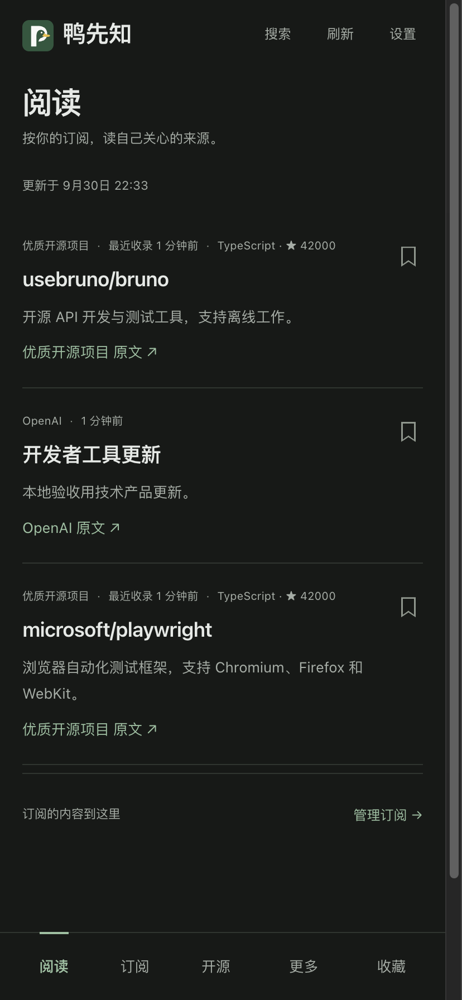
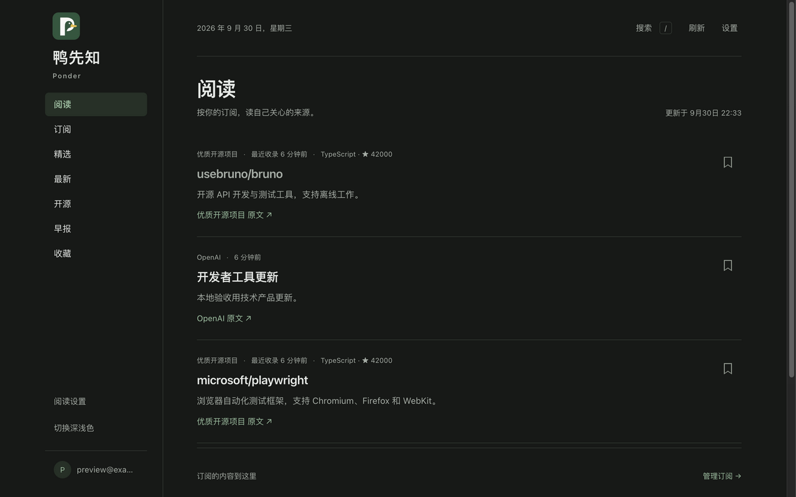

# Web 与 iOS 阅读入口一致性验收 — 2026-09-30

## 原因与线上状态

生产 Web 仍为旧版精选入口和邮件验证码登录；已安装的 iOS 是新版订阅阅读器。生产开源接口有真实 GitHub 项目，问题不是没有采集数据。本次未提交、推送或部署，线上行为未改变。

## 实现

- Web 默认阅读，新增订阅入口；手机底栏保留开源，更多菜单提供精选、最新、早报。
- 游客主动选择来源，可显式一键从 GitHub 开始；登录使用同账户 reader 设置与阅读 API，不覆盖已配置账户。
- 日常登录默认账号（邮箱）和密码；注册、找回密码、旧账户首次设置密码保留邮箱验证。
- 冷启动等待账户订阅，退出及账号变化作废旧内容与请求；扩展来源遵循开关，未知来源过滤。
- 订阅错误不回退全站快照。详情 URL 显式保留 reader=1，原文链接与来源复核；权威拒绝不使用本机副本复活。
- Service Worker shell 升级 v23，订阅与认证数据继续绕过共享缓存。长邮箱不撑出侧栏。

## 验证

- 完整 npm test：406 项通过，0 失败（真实退出码 0）。日志 `/tmp/aquasight-web-reader-tests-final.log`。
- 新增 6 项真实本地 HTTP/browser 测试：游客选择与刷新、详情刷新、旧后端与网络错误、密码登录无验证码请求、扩展开关与退出隔离、慢设置已有 cookie、404 禁止副本复活。
- Codex 修正 GLM 测试样本中未保留 githubRepo 字段、刷新请求等待先后顺序，并让 404 测试保留同一文档副本。
- 最终侧栏修复后，浏览器回归再次全部通过；日志 `/tmp/aquasight-web-reader-browser-final.log`。
- Worker production dry-run 打包通过，未执行部署。日志 `/tmp/aquasight-web-reader-build.log`。
- T3 浏览器：414×896 与 1280×800，本地合成账号密码登录成功，Web 内容 ID 与 iOS 使用的 reader API 完全一致；详情刷新保留范围；无页面或侧栏横向溢出。
- 本轮未重新跑物理 iOS，也未发送真实邮件。浏览器验收使用隔离本地数据，不代表生产已升级。

## 发布要求

Web 与 Worker 必须一起更新，并执行既有密码凭据表与查询索引迁移。当前仓库还有此前已验收但未发布的 iOS、密码、效率改动，应按变更范围审查并排除 output 与本地调度文件。生产密码运行时间和实际部署权限需在授权发布时核验。本报告不授权 App Store 提交。
